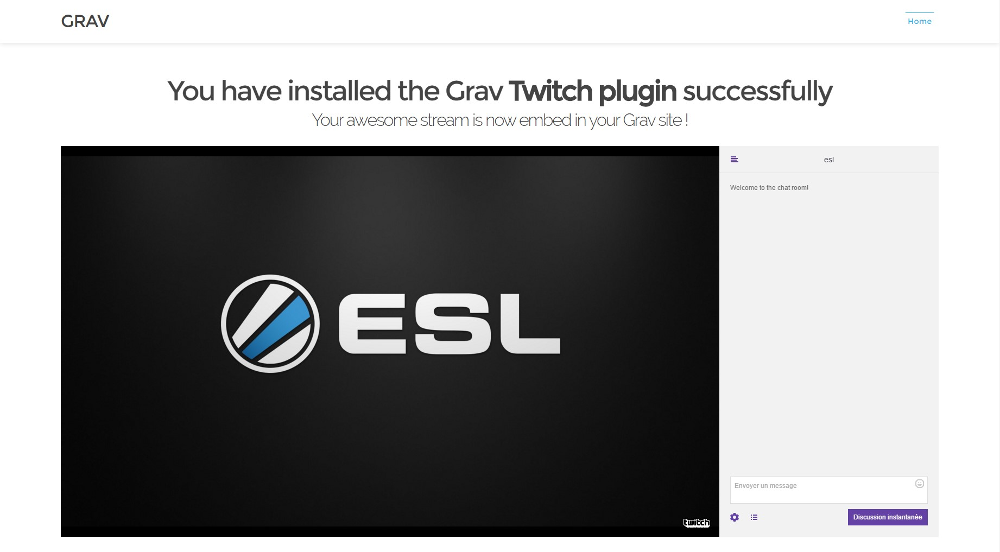

# Grav Twitch Plugin

[](https://gitter.im/lab-dev-code/grav-plugin-twitch?utm_source=badge&utm_medium=badge&utm_campaign=pr-badge&utm_content=badge)
[](https://insight.sensiolabs.com/projects/67493f66-260c-4f37-96ae-0667888a4f2f)

`Twitch` is a simple [Grav][grav] Plugin that converts markdown links into [Twitch.tv][twitch.tv] embeds.



# Installation

Installing the Twitch plugin can be done in one of two ways. The GPM (Grav Package Manager) installation method enables you to quickly and easily install the plugin with a simple terminal command, while the manual method enables you to do so via a zip file.

## GPM Installation (Preferred)

The simplest way to install this plugin is via the [Grav Package Manager (GPM)][grav-gpm]through your system's Terminal (also called the command line).  From the root of your Grav install type:

    bin/gpm install twitch

This will install the Twitch plugin into your `/user/plugins` directory within Grav. Its files can be found under `/your/site/grav/user/plugins/twitch`.

## Manual Installation

To install this plugin, just download the zip version of this repository and unzip it under `/your/site/grav/user/plugins`. Then, rename the folder to `twitch`. You can find these files either on [GitHub][homepage]or via [GetGrav.org][grav-plugins].

You should now have all the plugin files under

    /your/site/grav/user/plugins/twitch

# Config

## Config Defaults

```
enabled: true

player:
    enabled: true
    properties:
        frameborder: 0
        height: 720
        width: 75%
        style: 'float: left;'

chat:
    enabled: true
    properties:
        frameborder: 0
        height: 720
        width: 25%
        style: 'float: right'
```

> Note: those settings work pretty well with the default [Grav][grav] [Antimatter][antimatter] theme for a stream focused page layout but should probably be modified depending on your theme and your usage.

## Config File

If you need to change any value, then the best process is to copy the [twitch.yaml](twitch.yaml) file into your `users/config/plugins/` folder (create it if it doesn't exist), and then modify there.  This will override the default settings.

## Page-level Config

You can also use a page-level configuration by including a `twitch:` tag in your page front-matter. The content of this YAML tag is similar to the configuration file :

```
title: Home

twitch:
    player:
        enabled: true
        properties:
            frameborder: 0
            height: 720
            width: 75%
            style: 'float: left;'
    chat:
        enabled: true
        properties:
            frameborder: 0
            height: 720
            width: 25%
            style: 'float: right'
```

This method should be only used if the settings of the `Twitch` plugin are different from a page to another. (e.g: A stream preview on your homepage and the full stream with the chat on a dedicated page)

# Usage

To use this plugin you simply need to include a twitch channel name in a markdown link such as:

```
[plugin:twitch](esl)
```

This example will be converted into a Twitch embed of the [http://www.twitch.tv/esl](http://www.twitch.tv/esl) channel.

[antimatter]: https://github.com/getgrav/grav-theme-antimatter
[grav]: http://github.com/getgrav/grav
[grav-gpm]: http://learn.getgrav.org/advanced/grav-gpm
[grav-plugins]: http://getgrav.org/downloads/plugins#extras
[homepage]: https://github.com/lab-dev-code/grav-plugin-twitch
[twitch.tv]: http://www.twitch.tv/
